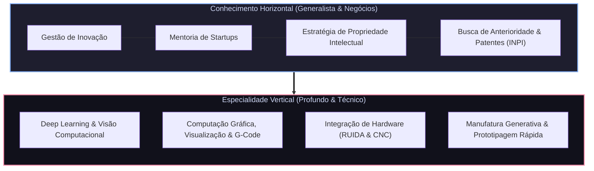
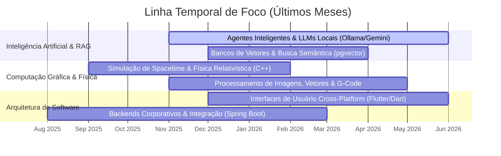

# Olá, eu sou o Rafael passosdomingues 👋

### T-Shaped Developer & Researcher | AI & Manufatura Generativa | Propriedade Intelectual

Sou um desenvolvedor e pesquisador atuando na interseção entre **Inteligência Artificial**, **Computação Gráfica** e **Manufatura Aditiva/Generativa**. Meu trabalho combina engenharia de software de alta especialização com estratégia de inovação, modelagem de negócios e proteção de ativos tecnológicos (patentes).

---

> [!NOTE]
> **Sobre o meu portfólio no GitHub**:
> Grande parte das soluções industriais, modelos de visão computacional e integradores de hardware que desenvolvo ativamente estão hospedados em **repositórios privados corporativos** ou protegidos sob acordos de confidencialidade (NDA) e segredo industrial. Neste perfil público, compartilho ferramentas utilitárias, frameworks de código aberto, projetos acadêmicos e estudos científicos.

---

## 🧭 O Perfil T-Shaped

Minha atuação é baseada em uma ampla base de conhecimentos em inovação e PI (eixo horizontal), sustentada por uma profunda especialização técnica em desenvolvimento de software e manufatura (eixo vertical).

---

## 📅 Foco e Linha Temporal de Desenvolvimento

Abaixo está o mapeamento cronológico de onde concentrei meus principais esforços de pesquisa e desenvolvimento nos últimos meses:

---

## 🚀 Impacto & Resultados de Pesquisa

*   **Ambientes de Inovação**: Prototipei mais de **30 projetos** físicos/digitais em 18 meses atuando em hub de base tecnológica universitário.
*   **Apoio ao Ecossistema**: Orientei e mentorei estrategicamente **4 startups** (sendo uma delas internacionalizada).
*   **Sistemas Próprios**: Desenvolvi **4 ferramentas de software** dedicadas a ambientes maker e gestão integrada de ecossistemas de inovação.
*   **Interface Homem-Máquina**: Pesquisa focada no uso experimental de modelos de linguagem (LLMs) para facilitar a geração de arquivos vetoriais, tradução para G-code e envio direto a controladoras de gravação/corte a laser (como RUIDA), reduzindo o atrito na materialização física de ideias.

---

## 🛠️ Stack Tecnológica & Ferramentas

### Linguagens e Frameworks

### Tecnologias e Infraestrutura

---

## 💡 Missão e Visão de PI

O maior gargalo do ciclo de inovação nacional é a **materialização prática de conceitos**. Busco mitigar esse obstáculo aproximando as ferramentas de modelagem da manufatura física e apoiando inventores na prospecção de anterioridades e redação técnica de patentes junto ao INPI. Isso diminui incertezas e acelera a validação e o registro de novos negócios.

---

📬 **Contato**:
*   **E-mail**: rafaelpassosdomingues@gmail.com
*   **GitHub**: [@passosdomingues](https://github.com/passosdomingues)
